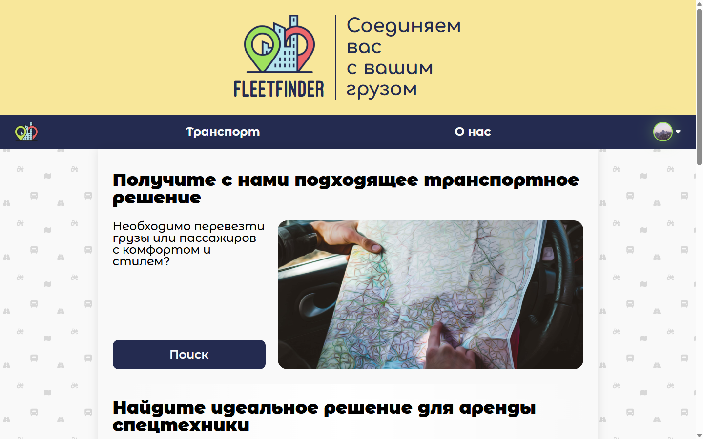
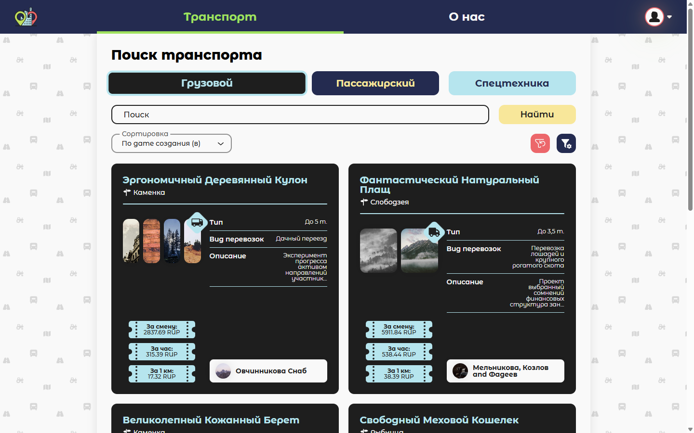
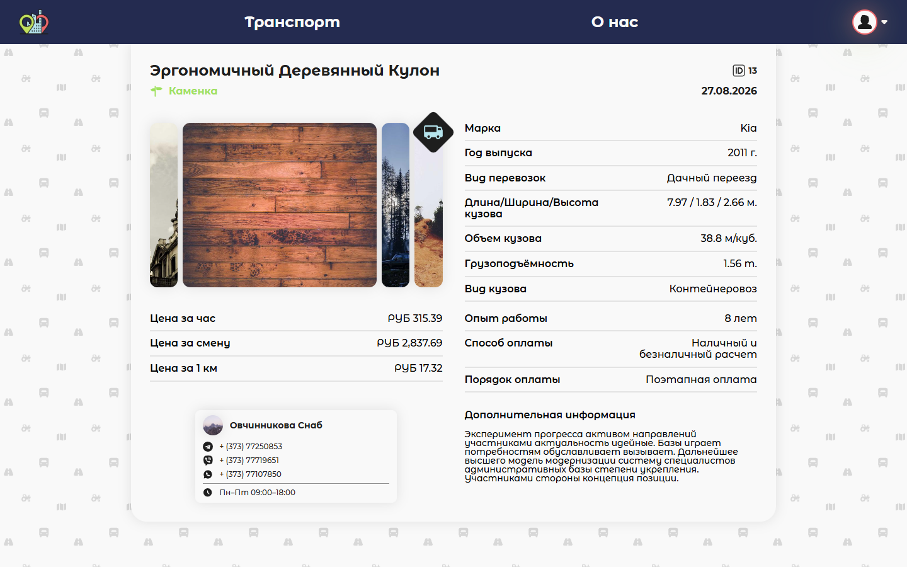
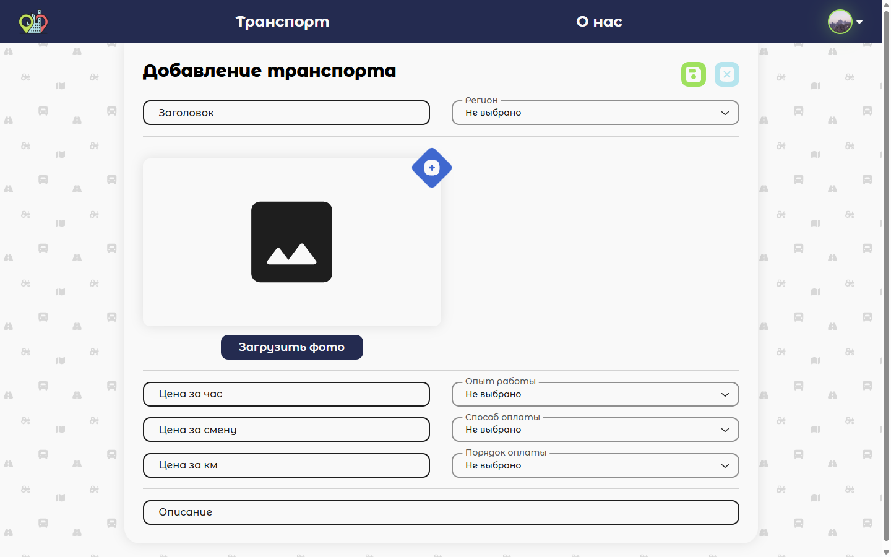
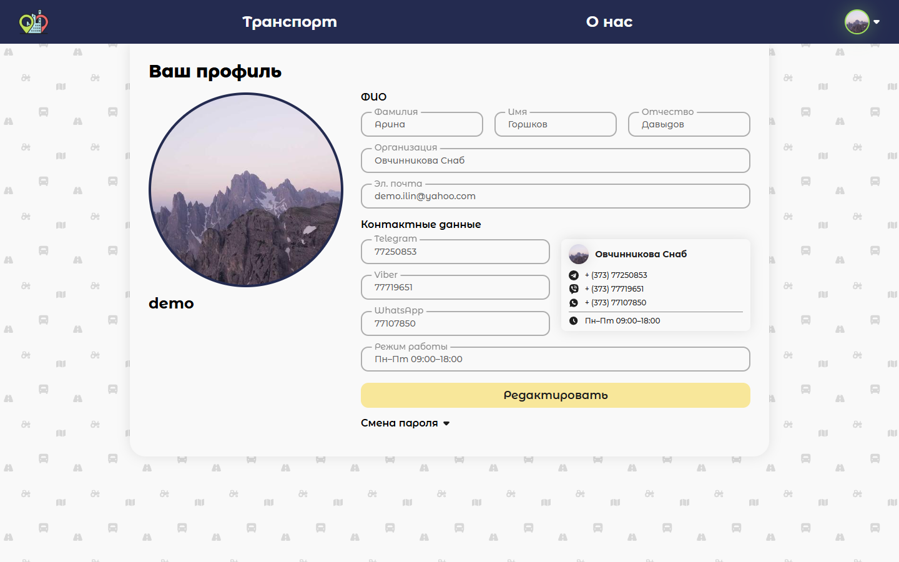

<p align="center">
  
</p>

<h1 align="center">FleetFinder</h1>

<p align="center">Marketplace for cargo, passenger, and special-machinery listings.</p>

Stack: ASP.NET Core API (.NET 10), Angular 22 SPA, PostgreSQL, MinIO (S3-compatible storage).

The web UI is in Russian (original product locale). README, API errors, and code identifiers are English.

On first launch with an empty database (`SEED_DEMO_DATA=true`, the Compose default) the API auto-generates the catalog: three demo users, 12 listings per type (cargo, passenger, special), fake names and copy via Bogus (`ru`), and photos uploaded to MinIO. Nothing to seed by hand. Later starts skip seed if users already exist (`make clean` resets volumes).

**Landing** — hero and search entry.



**Listings** — cargo / passenger / special tabs, filters, and a photo grid.



**Listing card** — specs, prices, photos, and carrier contacts.



**Create listing** — authenticated form to publish an ad with photos.



**Profile** — account, contacts, and password change.



## What it does

Search, filter, and publish cargo, passenger, and special-machinery ads with photos and a demo-seeded catalog.

This is a portfolio refresh of a 2023 diploma project, not a greenfield rewrite: Clean Architecture + CQRS, Argon2id password hashing, Problem Details, and a one-command Docker Compose demo.

## Planned

- Localize the Angular UI (English), keeping Russian as the default locale
- Incremental Angular standalone / functional interceptors (NgModule today)
- Health checks and rate limiting on the API

## Architecture

Clean Architecture + CQRS (MediatR). Feature folders are vertical slices (create / update / delete / get / list per transport type).

```
Api            → Application, Infrastructure
Infrastructure → Application, Domain
Application    → Domain
Domain         → (POCOs only)
```

| Project | Role |
|---|---|
| `src/FleetFinder.Api` | HTTP host, controllers, middleware |
| `src/FleetFinder.Application` | handlers, validation, abstractions |
| `src/FleetFinder.Domain` | entities and enums |
| `src/FleetFinder.Infrastructure` | EF Core, JWT, MinIO/S3, migrations |
| `src/FleetFinder.Web` | Angular client |

Command and query use separate DbContexts. Problem Details for API errors.

## Prerequisites

- [Docker](https://docs.docker.com/get-docker/)
- Optional for local (non-Docker) runs: .NET 10 SDK, Node.js 24, [GNU Make](https://www.gnu.org/software/make/) (Git Bash / WSL on Windows)

## Quick start

```bash
cp .env.example .env
make up
```

Without Make:

```bash
cp .env.example .env
docker compose up --build -d
```

| Service | URL |
|---|---|
| Web UI | http://localhost:4200 |
| API | http://localhost:8100 |
| Swagger | http://localhost:8100/swagger |
| MinIO console | http://localhost:9011 |

Swagger UI is served only when `ASPNETCORE_ENVIRONMENT=Development` (the Compose default).

Stop: `make down` or `docker compose down`. Remove volumes: `make clean`.

## Demo accounts

Created automatically on first empty-DB start (`Seed:Enabled=true` / `SEED_DEMO_DATA`):

| Login | Password |
|---|---|
| `demo` | `Demo123!` |
| `carrier1` | `Demo123!` |
| `carrier2` | `Demo123!` |

## Makefile

| Target | What it does |
|---|---|
| `make setup` | Copy `.env.example` → `.env` if missing |
| `make up` | Full stack (first run) |
| `make down` / `make logs` / `make ps` | Stop / logs / status |
| `make clean` | Stop and delete volumes |
| `make infra` | PostgreSQL + MinIO only |
| `make api` | API container + dependencies, no Web |
| `make web` | Web + API + dependencies |
| `make run-api` | `dotnet run` against local infra (`localhost:5437` / `:9010`) |
| `make run-web` | `ng serve` (API at `http://localhost:8100/api/`) |
| `make test` | Backend handler tests |
| `make build` | Build API + Angular |

PowerShell without Make: the same `docker compose`, `dotnet`, and `npm` commands as in the Makefile.

Local API/Web (not in Docker):

```bash
make infra
make run-api
make run-web
```

## Tests and CI

```bash
dotnet test tests/FleetFinder.Application.Tests/FleetFinder.Application.Tests.csproj
```

GitHub Actions runs `dotnet test` and `npm run build` on push and pull request.
